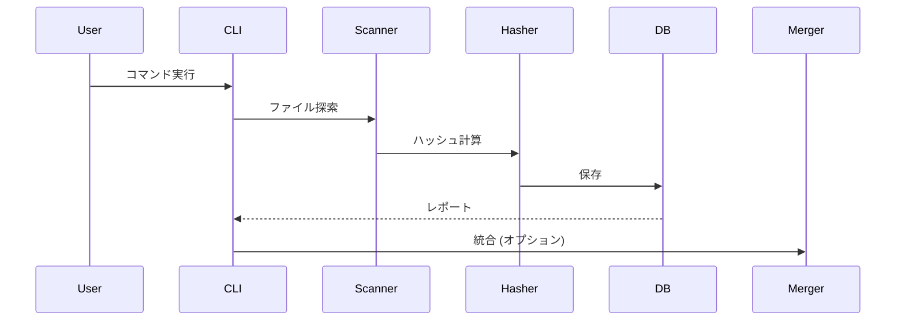

# Design Document Template

---
**Purpose**: Provide sufficient detail to ensure implementation consistency across different implementers, preventing interpretation drift.

**Approach**:
- Include essential sections that directly inform implementation decisions
- Omit optional sections unless critical to preventing implementation errors
- Match detail level to feature complexity
- Use diagrams and tables over lengthy prose

**Warning**: Approaching 1000 lines indicates excessive feature complexity that may require design simplification or splitting into multiple specs.
---

> Sections may be reordered (e.g., surfacing Requirements Traceability earlier or moving Data Models nearer Architecture) when it improves clarity. Within each section, keep the flow **Summary → Scope → Decisions → Impacts/Risks** so reviewers can scan consistently.

## Overview 
2-3 paragraphs max
**Purpose**: この機能はファイルの重複チェックと統合を行うCLIツールを提供する。
**Users**: ユーザーはコマンドラインからディレクトリを指定して重複ファイルを検出・統合できる。
**Impact** (if applicable): 重複ファイルを効率的に管理可能にする。

### Goals
- ファイル重複の検出とレポート
- オプションでのファイル統合
- SQLite DBを使用したデータ保存

### Non-Goals
- GUIインターフェース
- クラウドストレージ対応
- 高度なファイル比較アルゴリズム

## Boundary Commitments

State the responsibility boundary of this spec in concrete terms. Treat this as the anchor for architecture, tasks, and later validation.

### This Spec Owns
- CLIインターフェースの提供
- ファイル探索とハッシュ計算
- DB保存とレポート

### Out of Boundary
- 外部API統合
- 高度なセキュリティ機能
- マルチスレッド処理

### Allowed Dependencies
- Python標準ライブラリ
- Typerライブラリ

### Revalidation Triggers
- Pythonバージョン変更
- Typer API変更

## Architecture

> Reference detailed discovery notes in `research.md` only for background; keep design.md self-contained for reviewers by capturing all decisions and contracts here.
> Capture key decisions in text and let diagrams carry structural detail—avoid repeating the same information in prose.
> Supporting sections below should remain as light as possible unless they materially clarify the responsibility boundary, dependency rules, or integration seams.

### Existing Architecture Analysis (if applicable)
新規機能のため既存アーキテクチャなし。

### Architecture Pattern & Boundary Map
**RECOMMENDED**: Include Mermaid diagram showing the chosen architecture pattern and system boundaries (required for complex features, optional for simple additions)

**Architecture Integration**:
- Selected pattern: モジュール化アーキテクチャ
- Domain/feature boundaries: CLI, ファイル処理, DB, ログ
- Existing patterns preserved: なし
- New components rationale: 各機能を分離
- Steering compliance: なし

### Technology Stack

| Layer | Choice / Version | Role in Feature | Notes |
|-------|------------------|-----------------|-------|
| CLI | Typer | コマンドラインインターフェース | |
| Backend | Python 3.14 | コアロジック | |
| Data | SQLite | データ保存 | 標準ライブラリ |
| Infrastructure | logging | ログ出力 | 標準ライブラリ |
| Package Manager | uv | 依存関係管理 | |

## File Structure Plan

Map the directory structure and file responsibilities for this feature. This section directly drives task `_Boundary:_` annotations and implementation Task Briefs. Use the appropriate level of detail:

- **Small features**: List individual files with responsibilities
- **Large features**: Describe directory-level structure + per-domain/module pattern, list only non-obvious files individually

### Directory Structure
```
duplicate_filechecker/
├── __init__.py
├── cli.py              # CLIインターフェース
├── scanner.py          # ファイル探索
├── hasher.py           # ハッシュ計算
├── database.py         # DB操作
├── merger.py           # ファイル統合
└── logger.py           # ログ設定
```

### Modified Files
- main.py — エントリーポイント

## System Flows

Provide only the diagrams needed to explain non-trivial flows. Use pure Mermaid syntax. Common patterns:
- Sequence (multi-party interactions)
- Process / state (branching logic or lifecycle)
- Data / event flow (pipelines, async messaging)

Skip this section entirely for simple CRUD changes.



## Requirements Traceability

Use this section for complex or compliance-sensitive features where requirements span multiple domains. Straightforward 1:1 mappings can rely on the Components summary table.

Map each requirement ID (e.g., `2.1`) to the design elements that realize it.

| Requirement | Summary | Components | Interfaces | Flows |
|-------------|---------|------------|------------|-------|
| 1.1 | ファイル探索 | Scanner | CLI | 探索フロー |
| 1.4 | 再起探索 | Scanner | ファイルシステム | 再起フロー |
| 2.1 | ハッシュ計算 | Hasher | DB | 計算フロー |
| 3.1 | DB保存 | Database | SQLite | 保存フロー |
| 4.1 | レポート | CLI | Console | レポートフロー |
| 5.1 | 統合 | Merger | FileSystem | 統合フロー |
| 6.1 | ログ | Logger | logging | ログフロー |
| 6.3 | ログディレクトリ | Logger | ファイルシステム | ログディレクトリ |
| 6.4 | ログローテーション | Logger | logging | ローテーション |
| 6.5 | スキップログ | Logger | Hasher | ログフロー |
| 6.6 | 移動ログ | Logger | Merger | ログフロー |
| 6.7 | 処理時間ログ | Logger | CLI | ログフロー |
| 6.8 | スキップログに幹ファイル | Logger | Hasher | ログフロー |
| 7.1 | CLI | CLI | Typer | CLIフロー |

## Components and Interfaces

Provide a quick reference before diving into per-component details.

- Summaries can be a table or compact list. Example table:
  | Component | Domain/Layer | Intent | Req Coverage | Key Dependencies (P0/P1) | Contracts |
  |-----------|--------------|--------|--------------|--------------------------|-----------|
  | CLI | UI | コマンド解析 | 7 | Typer (P0) | Service |
  | Scanner | Core | ファイル探索 | 1 | pathlib (P0) | Service |
  | Hasher | Core | ハッシュ計算 | 2 | hashlib (P0) | Service |
  | Database | Data | DB操作 | 3 | sqlite3 (P0) | Service |
  | Merger | Core | ファイル統合 | 5 | shutil (P0) | Service |
  | Logger | Infra | ログ設定 | 6 | logging (P0) | Service |

Group detailed blocks by domain or architectural layer. For each detailed component, list requirement IDs as `2.1, 2.3` (omit "Requirement"). When multiple UI components share the same contract, reference a base interface/props definition instead of duplicating code blocks.

### Core Layer

#### Scanner

| Field | Detail |
|-------|--------|
| Intent | ファイル探索機能 |
| Requirements | 1.1 |
| Owner / Reviewers | (optional) |

**Responsibilities & Constraints**
- 指定ディレクトリからファイル探索
- パターンマッチング

**Dependencies**
- Inbound: CLI — 引数受け取り (P0)
- Outbound: Hasher — ファイルパス渡し (P0)
- External: pathlib — ファイル操作 (P0)

**Contracts**: Service [x]

##### Service Interface
```python
class Scanner:
    def scan(self, directory: str, pattern: str) -> list[str]:
        pass
```

#### Hasher

| Field | Detail |
|-------|--------|
| Intent | ハッシュ計算機能 |
| Requirements | 2.1, 2.2, 2.3 |
| Owner / Reviewers | (optional) |

**Responsibilities & Constraints**
- ファイルハッシュ計算
- DBキャッシュチェック
- DBにハッシュ値が存在する場合は計算をスキップし、その事象をCLIへ通知

**Dependencies**
- Inbound: Scanner — ファイルパス (P0)
- Outbound: Database — 保存 (P0)
- External: hashlib — ハッシュ (P0)

**Contracts**: Service [x]

##### Service Interface
```python
class Hasher:
    def calculate_hash(self, file_path: str) -> tuple[str, bool]:
        pass
```

#### Database

| Field | Detail |
|-------|--------|
| Intent | DB操作機能 |
| Requirements | 3.1, 3.2 |
| Owner / Reviewers | (optional) |

**Responsibilities & Constraints**
- SQLite DB操作
- データ保存・取得

**Dependencies**
- Inbound: Hasher — データ (P0)
- Outbound: CLI — レポート (P0)
- External: sqlite3 — DB (P0)

**Contracts**: Service [x]

##### Service Interface
```python
class Database:
    def save(self, file_path: str, hash_value: str) -> None:
        pass
    def get_hash(self, file_path: str) -> str | None:
        pass
```

#### Merger

| Field | Detail |
|-------|--------|
| Intent | ファイル統合機能 |
| Requirements | 5.1, 5.2, 5.3 |
| Owner / Reviewers | (optional) |

**Responsibilities & Constraints**
- 幹ファイル残し枝ファイル移動
- ディレクトリ構造維持
- 移動先ディレクトリが存在しない場合は作成し、既存の場合はそのまま利用
- 移動先に同名ファイルが存在する場合は、移動元と移動先のパスをログ出力し、ファイル名に `_${数字}` を付与して重複を回避

**Dependencies**
- Inbound: CLI — 統合スイッチ (P0)
- Outbound: FileSystem — 移動 (P0)
- External: shutil — ファイル操作 (P0)
- External: logging — 競合ログ出力 (P0)

**Contracts**: Service [x]

##### Service Interface
```python
class Merger:
    def merge(self, duplicates: dict[str, list[str]], trash_dir: str) -> int:
        pass
```

### UI Layer

#### CLI

| Field | Detail |
|-------|--------|
| Intent | CLIインターフェース |
| Requirements | 4.1, 7.1, 7.2 |
| Owner / Reviewers | (optional) |

**Responsibilities & Constraints**
- 引数解析
- 処理実行
- DBキャッシュ適用時のハッシュスキップをスキップ数として集計
- 統計レポート表示（探索ファイル総数、スキップ数、処理数、ユニークファイル総数）

**Dependencies**
- Inbound: User — コマンド (P0)
- Outbound: Scanner — 実行 (P0)
- External: Typer — CLI (P0)

**Contracts**: Service [x]

##### Service Interface
```python
@app.command()
def main(directory: str, pattern: str = "*.mp4", trash_dir: str = None, merge: bool = False):
    # trash_dirのデフォルトは探索するディレクトリのパスに .dup_trash を付与したパス
    pass
```

### Infra Layer

#### Logger

| Field | Detail |
|-------|--------|
| Intent | ログ設定機能 |
| Requirements | 6.1, 6.2, 6.3, 6.4, 6.5, 6.6, 6.7, 6.8 |
| Owner / Reviewers | (optional) |

**Responsibilities & Constraints**
- logging設定
- ファイルとコンソール出力
- ログディレクトリ作成
- デイリーローテーション
- スキップ時のログ出力
- 移動時のログ出力
- 処理時間のログ出力

**Dependencies**
- Inbound: All — ログ呼び出し (P0)
- Outbound: logging — 出力 (P0)
- External: logging — ライブラリ (P0)

**Contracts**: Service [x]

##### Service Interface
```python
class Logger:
    def setup(self) -> None:
        pass
    def log_file(self, file_path: str) -> None:
        pass
    def log_skip(self, skipped_file: str, stem_file: str) -> None:
        pass
    def log_move(self, source_path: str, target_path: str) -> None:
        pass
    def log_duration(self, duration: float) -> None:
        pass
```