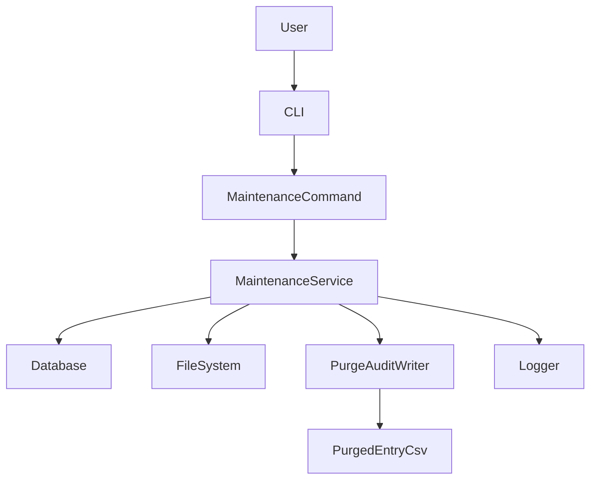
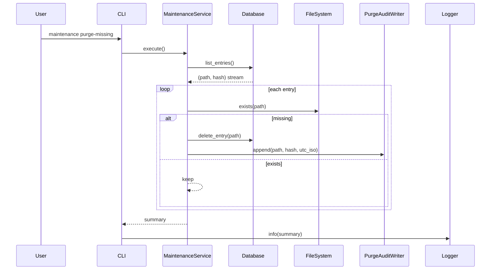

# Design Document

## Overview
**Purpose**: 本機能は、DBキャッシュの保守を安全に実行するメンテナンス用サブコマンドを追加する。具体的には、DBエントリーのパス存在確認、不存在エントリー削除、削除監査ログの出力を提供する。
**Users**: 重複チェックを継続運用する開発者/運用者が、古いDBエントリーを定期的にクリーンアップする用途で利用する。
**Impact**: 既存の重複判定精度と実行速度に影響する古いキャッシュを抑制し、監査可能な削除履歴を残せるようにする。

### Goals
- DB全エントリーを対象に実在パスを検証する。
- 不存在パスのエントリーのみを削除する。
- 削除履歴を `logs/purged_entry.csv` にタブ区切りで追記する。
- 既存のメイン処理コマンドと責務を分離する。

### Non-Goals
- DBスキーマ変更（テーブル追加・列追加）。
- 削除対象の自動復元機能。
- 監査ファイルのローテーションや圧縮。

## Boundary Commitments

### This Spec Owns
- メンテナンス用サブコマンドのCLI境界。
- DBエントリー走査、ファイル存在判定、削除実行の制御。
- 削除エントリー監査ログ（TSV形式）出力契約。
- エントリー単位の例外処理と継続実行。

### Out of Boundary
- 既存重複検出フロー（`main` コマンド）のアルゴリズム変更。
- DBファイル配置ポリシーの再設計。
- 監査ログの外部送信（SIEM連携など）。

### Allowed Dependencies
- Python標準ライブラリ: `pathlib`, `datetime`, `csv`, `sqlite3`。
- 既存Typer CLI基盤。
- 既存Logger（ファイル/コンソール出力）。

### Revalidation Triggers
- `files` テーブルのカラム構成変更。
- CLIコマンド体系変更（サブコマンド構成変更）。
- 監査ログ出力フォーマット変更（区切り文字・列順・時刻形式）。

## Architecture

### Existing Architecture Analysis
- 現行は `cli.py` の `main` コマンドを中心に、`Scanner` / `Hasher` / `Database` / `Merger` / `Logger` を組み合わせる構成。
- `Database` は単一責務で `save/get_hash/get_stem_file` を提供しており、保守系API（全件取得・削除）は未提供。
- `Logger` は `logs` ディレクトリ作成責務を既に持つ。

### Architecture Pattern & Boundary Map
**Architecture Integration**:
- Selected pattern: 既存モジュール分離を維持したCLIオーケストレーション + サービス分離。
- Domain/feature boundaries: CLI層（引数/実行）、保守サービス層（判定/削除）、データ層（DBアクセス）、監査出力層（TSV追記）。
- Existing patterns preserved: DBアクセスを `Database` 経由に限定する方針。
- New components rationale: 保守処理を `main` から分離し、テストと運用を独立させるため。
- Steering compliance: ステアリング未配置のため既存コードの責務分離パターンへ整合。



### Technology Stack

| Layer | Choice / Version | Role in Feature | Notes |
|-------|------------------|-----------------|-------|
| CLI | Typer (existing) | サブコマンド公開 | 既存コマンドと分離 |
| Backend | Python 3.14 | 保守ロジック実行 | 型ヒント必須 |
| Data | SQLite (`sqlite3`) | エントリー取得/削除 | 既存 `files` テーブル利用 |
| Infrastructure | `logging`, `pathlib`, `datetime`, `csv` | 可観測性と監査出力 | 追加依存なし |

## File Structure Plan

### Directory Structure
```
duplicate_filechecker/
├── cli.py                 # maintenance サブコマンドの追加
├── database.py            # list_entries/delete_entry の追加
├── maintenance.py         # 保守ユースケースの新規サービス
└── logger.py              # 例外/要約ログ呼び出しに利用
```

### Modified Files
- `duplicate_filechecker/cli.py` — `maintenance` 系サブコマンドを追加し、既存 `main` との境界を分離。
- `duplicate_filechecker/database.py` — 全件取得と削除の公開インターフェースを追加。
- `duplicate_filechecker/logger.py` — 既存ロガーを流用（新規メソッド追加は任意、必須ではない）。
- `duplicate_filechecker/maintenance.py` — 走査・削除・監査出力を実装する新規コンポーネント。

## System Flows



主要判断:
- 例外はエントリー単位で捕捉し、ログ記録後に次エントリーへ継続する。
- 監査行は削除成功後のみ追記し、DB状態との整合を保つ。

## Requirements Traceability

| Requirement | Summary | Components | Interfaces | Flows |
|-------------|---------|------------|------------|-------|
| 1.1 | DB全エントリー取得 | Database, MaintenanceService | `list_entries()` | purge flow |
| 1.2 | 独立サブコマンド提供 | CLI | `maintenance purge-missing` | purge flow |
| 2.1 | 不存在エントリー削除 | MaintenanceService, Database | `delete_entry(path)` | purge flow |
| 2.2 | 存在エントリー維持 | MaintenanceService | `Path.exists()` 判定 | purge flow |
| 3.1 | 削除監査をCSV追記 | PurgeAuditWriter | `append(...)` | purge flow |
| 3.2 | タブ区切り3列形式 | PurgeAuditWriter | TSV row contract | purge flow |
| 3.3 | logs作成 | PurgeAuditWriter | output path contract | purge flow |
| 4.1 | 例外ログ出力 | MaintenanceService, Logger | exception logging contract | purge flow |
| 4.2 | 継続実行 | MaintenanceService | per-entry try/except | purge flow |

## Components and Interfaces

| Component | Domain/Layer | Intent | Req Coverage | Key Dependencies (P0/P1) | Contracts |
|-----------|--------------|--------|--------------|--------------------------|-----------|
| MaintenanceCommand | CLI | 保守サブコマンド入口 | 1.2 | MaintenanceService(P0), Logger(P1) | Service |
| MaintenanceService | Application | 走査/判定/削除/継続制御 | 1.1, 2.1, 2.2, 4.1, 4.2 | Database(P0), PurgeAuditWriter(P0), Logger(P1) | Service |
| DatabaseExtension | Data | エントリー列挙/削除 | 1.1, 2.1 | sqlite3(P0) | Service |
| PurgeAuditWriter | Infrastructure | 監査TSV追記 | 3.1, 3.2, 3.3 | pathlib(P0), datetime(P0), csv(P1) | Batch |

### CLI Layer

#### MaintenanceCommand

| Field | Detail |
|-------|--------|
| Intent | メンテナンス処理起動と終了サマリー表示 |
| Requirements | 1.2 |

**Responsibilities & Constraints**
- `main` コマンドと独立したコマンド名空間を提供する。
- 入出力は保守処理結果サマリーに限定する。

**Dependencies**
- Outbound: `MaintenanceService` — 実処理呼び出し (P0)
- Outbound: `Logger` — サマリー/異常ログ出力 (P1)

**Contracts**: Service [x] / API [ ] / Event [ ] / Batch [ ] / State [ ]

##### Service Interface
```python
class MaintenanceCommandPort:
    def purge_missing(self) -> "PurgeSummary":
        ...
```
- Preconditions: DBへアクセス可能であること。
- Postconditions: 実行サマリーを返すこと。
- Invariants: 既存 `main` の動作契約を変更しないこと。

### Application Layer

#### MaintenanceService

| Field | Detail |
|-------|--------|
| Intent | DBエントリーの検証・削除・監査出力を統括 |
| Requirements | 1.1, 2.1, 2.2, 4.1, 4.2 |

**Responsibilities & Constraints**
- 全エントリーを逐次処理し、`Path.exists()` で実在判定する。
- 不存在時にのみ削除を実行し、成功時のみ監査ログへ追記する。
- エントリー単位例外で処理継続する。

**Dependencies**
- Outbound: `Database` — 取得/削除 (P0)
- Outbound: `PurgeAuditWriter` — 監査行追加 (P0)
- Outbound: `Logger` — 例外記録 (P1)

**Contracts**: Service [x] / API [ ] / Event [ ] / Batch [ ] / State [ ]

##### Service Interface
```python
from dataclasses import dataclass

@dataclass(frozen=True)
class PurgeEntry:
    path: str
    hash_value: str

@dataclass(frozen=True)
class PurgeSummary:
    scanned: int
    purged: int
    failed: int

class MaintenanceService:
    def purge_missing_entries(self) -> PurgeSummary:
        ...
```
- Preconditions: `Database.list_entries()` が `(path, hash)` を返せること。
- Postconditions: 削除件数と失敗件数が集計されること。
- Invariants: 存在するパスは削除しない。

### Data Layer

#### DatabaseExtension

| Field | Detail |
|-------|--------|
| Intent | 保守処理に必要な列挙/削除インターフェースを提供 |
| Requirements | 1.1, 2.1 |

**Dependencies**
- External: `sqlite3` — SQL実行 (P0)

**Contracts**: Service [x] / API [ ] / Event [ ] / Batch [ ] / State [ ]

##### Service Interface
```python
class Database:
    def list_entries(self) -> list[tuple[str, str]]:
        ...

    def delete_entry(self, file_path: str) -> None:
        ...
```
- Preconditions: `files(path, hash)` テーブルが存在すること。
- Postconditions: `delete_entry` 実行後、対象パス行が存在しないこと。
- Invariants: `delete_entry` は単一パスのみ削除する。

### Infrastructure Layer

#### PurgeAuditWriter

| Field | Detail |
|-------|--------|
| Intent | 削除監査行を `logs/purged_entry.csv` に追記 |
| Requirements | 3.1, 3.2, 3.3 |

**Dependencies**
- External: `pathlib` — 出力ディレクトリ準備 (P0)
- External: `datetime` — UTC時刻生成 (P0)
- External: `csv` — 区切り指定で出力 (P1)

**Contracts**: Service [ ] / API [ ] / Event [ ] / Batch [x] / State [ ]

##### Batch / Job Contract
- Trigger: `MaintenanceService` が削除成功時に呼び出す。
- Input / validation: `path` 非空、`hash_value` 非空。
- Output / destination: `logs/purged_entry.csv` へタブ区切り1行追記。
- Idempotency & recovery: 同一削除の再実行時は追加行が増えるため、上位で重複実行を管理する。

## Data Models

### Domain Model
- `PurgeEntry(path, hash_value)` は検証対象。
- `PurgeSummary(scanned, purged, failed)` は実行結果。
- 監査行は `(path, hash_value, processed_at_utc)` の3要素で構成。

### Logical Data Model
- 既存 `files` テーブルを再利用。
- 参照: `SELECT path, hash FROM files`。
- 削除: `DELETE FROM files WHERE path = ?`。

### Physical Data Model
- スキーマ追加なし。
- 既存主キー `path` により削除対象は一意。
- 監査ファイルは行追記型で、1行1削除イベント。

## Risks & Mitigations
- リスク: 誤削除の検知遅延。
  - 対策: 監査行にUTCタイムスタンプを必須化。
- リスク: 大量削除時のI/O増加。
  - 対策: 1行追記のストリーム書き込みでメモリ固定。
- リスク: コマンド誤実行。
  - 対策: サブコマンド名を `maintenance purge-missing` と明示し主機能から分離。
