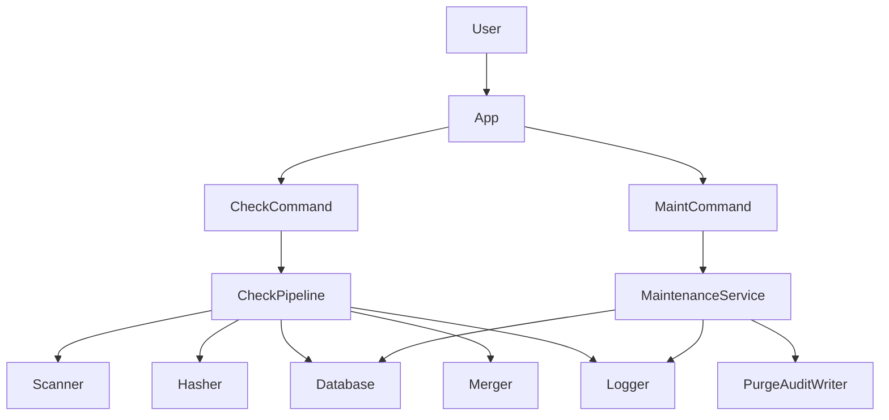
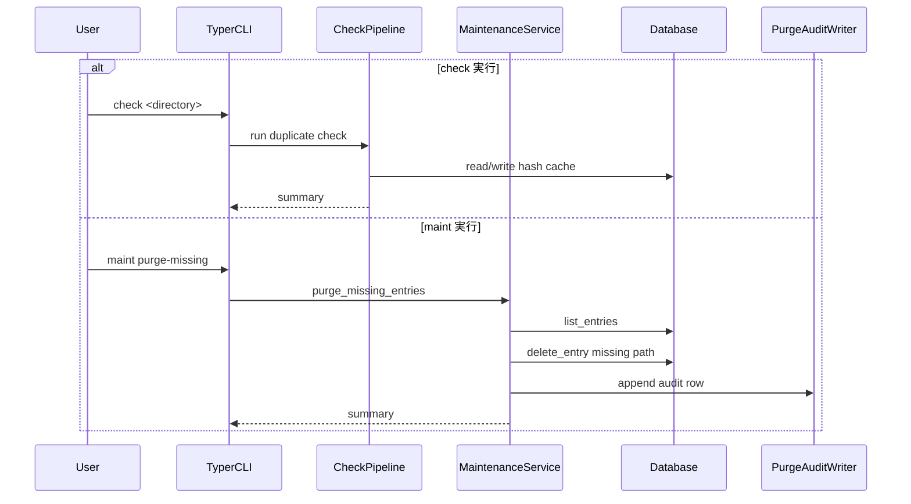

# Design Document

## Overview
**Purpose**: 本機能はCLIルーティングをTyperサブコマンドへ統一し、既存の重複チェック機能を `check`、メンテナンス機能を `maint` として提供する。あわせて、`maint` 配下でDB整合性保守（不存在パス削除と監査出力）を継続提供する。
**Users**: 日常的に重複チェックを行う利用者と、DBキャッシュを保守する運用者。
**Impact**: コマンド体系の明確化により誤操作を減らし、CLI拡張時の保守性を向上させる。

### Goals
- 重複チェックをTyperサブコマンド `check` として提供する。
- メンテナンス機能をTyperサブコマンド `maint` として提供する。
- `main.py` の手動ルーティングを廃止し、Typerへ一元化する。
- 既存の保守要件（削除・監査出力・例外継続）を維持する。

### Non-Goals
- 重複判定ロジックそのものの変更。
- DBスキーマ変更。
- 監査出力フォーマット（タブ区切り3列）の変更。

## Boundary Commitments

### This Spec Owns
- Typer CLIのサブコマンド境界（`check` / `maint`）の定義。
- `maint` から保守サービスを呼び出すルーティング契約。
- 既存保守機能の公開インターフェース維持（DB走査/削除/監査/継続）。

### Out of Boundary
- ハッシュ計算や重複判定アルゴリズムの最適化。
- ログ基盤（ローテーション設定）の再設計。
- 監査ログの外部連携。

### Allowed Dependencies
- Typer（既存依存）。
- Python標準ライブラリ（`sqlite3`, `pathlib`, `datetime`, `csv`, `logging`）。
- 既存コンポーネント（Database, MaintenanceService, Logger, Scanner, Hasher, Merger）。

### Revalidation Triggers
- Typer CLI構造の変更（新サブコマンド追加、既存名称変更）。
- `main.py` エントリポイント責務変更。
- 保守サービス入出力契約（summary/audit列）の変更。

## Architecture

### Existing Architecture Analysis
- 現行は重複チェック処理が `main` コマンド中心で、メンテナンス処理はTyper外導線が混在している。
- 保守機能のサービス分離（MaintenanceService/PurgeAuditWriter）は既に存在し、CLI層のみ再配線で統一可能。

### Architecture Pattern & Boundary Map
**Architecture Integration**:
- Selected pattern: Typer中心の階層サブコマンド + サービス分離。
- Domain/feature boundaries: CLI層はルーティング専任、アプリ層はユースケース実行、データ層はDB操作、インフラ層は監査出力。
- Existing patterns preserved: 処理本体をサービス/コンポーネントへ寄せる責務分離。
- New components rationale: `check`/`maint` の明示化で運用と拡張を安定化。
- Steering compliance: ステアリング未配置のため、既存責務分離方針への整合で対応。



### Technology Stack & Alignment

| Layer | Choice / Version | Role in Feature | Notes |
|-------|------------------|-----------------|-------|
| CLI | Typer | `check` / `maint` サブコマンド定義 | ルーティング一元化 |
| Backend | Python 3.14 | ユースケース実行 | 型ヒント維持 |
| Data | SQLite (`sqlite3`) | エントリー取得/削除/参照 | 既存 `files` テーブル利用 |
| Infrastructure | `logging`, `pathlib`, `datetime`, `csv` | 可観測性・監査出力 | 既存方式維持 |

## File Structure Plan

### Directory Structure
```
duplicate_filechecker/
├── cli.py            # Typerのcheck/maintサブコマンド定義
├── maintenance.py    # maint用ユースケース
├── database.py       # list/deleteなど保守用DB API
└── logger.py         # ログ出力
main.py               # app起動のみ
```

### Modified Files
- `duplicate_filechecker/cli.py` — `check` と `maint` サブコマンド定義、旧単一導線の整理。
- `main.py` — 手動ディスパッチ廃止、Typer `app()` 呼び出しへ統一。
- `duplicate_filechecker/maintenance.py` — `maint` ルーティング契約に合わせた公開境界確認。
- `duplicate_filechecker/tests/*` — サブコマンド命名変更と回帰検証の更新。

## System Flows



主要判断:
- `main.py` はTyper呼び出しのみとし、ルーティング責務を重複させない。
- `maint` の処理本体はサービス層へ保持し、CLIは入出力境界に限定する。

## Requirements Traceability

| Requirement | Summary | Components | Interfaces | Flows |
|-------------|---------|------------|------------|-------|
| 1.1 | DB全エントリー取得 | MaintenanceService, Database | `list_entries()` | maint flow |
| 1.2 | 独立サブコマンド提供 | Typer CLI | `maint` | maint flow |
| 2.1 | 不存在エントリー削除 | MaintenanceService, Database | `delete_entry(path)` | maint flow |
| 2.2 | 存在エントリー維持 | MaintenanceService | `Path.exists()` 判定 | maint flow |
| 3.1 | 削除監査追記 | PurgeAuditWriter | `append(path, hash, utc)` | maint flow |
| 3.2 | タブ区切り3列 | PurgeAuditWriter | TSV row contract | maint flow |
| 3.3 | logs作成 | PurgeAuditWriter | output path contract | maint flow |
| 4.1 | 例外ログ出力 | MaintenanceService, Logger | exception logging | maint flow |
| 4.2 | 例外時継続 | MaintenanceService | per-entry try/except | maint flow |
| 5.1 | 重複チェックはcheck | Typer CLI, CheckPipeline | `check` | check flow |
| 5.2 | メンテはmaint | Typer CLI, MaintenanceService | `maint` | maint flow |
| 5.3 | 手動分岐禁止 | main entrypoint | `app()` only | check/maint flow |

## Components & Interface Contracts

| Component | Domain/Layer | Intent | Req Coverage | Key Dependencies | Contracts |
|-----------|--------------|--------|--------------|------------------|-----------|
| CheckCommand | CLI | 重複チェック機能の公開入口 | 5.1 | CheckPipeline(P0), Logger(P1) | Service |
| MaintCommand | CLI | メンテ機能の公開入口 | 1.2, 5.2 | MaintenanceService(P0), Logger(P1) | Service |
| CheckPipeline | Application | 既存重複チェック処理を実行 | 5.1 | Scanner(P0), Hasher(P0), Database(P0), Merger(P1) | Service |
| MaintenanceService | Application | 不存在エントリー削除と監査出力 | 1.1, 2.1, 2.2, 4.1, 4.2, 5.2 | Database(P0), PurgeAuditWriter(P0), Logger(P1) | Service |
| PurgeAuditWriter | Infrastructure | 監査行をTSVで追記 | 3.1, 3.2, 3.3 | pathlib(P0), datetime(P0), csv(P1) | Batch |
| Entrypoint | Runtime | Typer起動のみを担当 | 5.3 | Typer(P0) | State |

### CLI Layer

#### CheckCommand

| Field | Detail |
|-------|--------|
| Intent | 重複チェック処理を `check` 名で公開 |
| Requirements | 5.1 |

**Responsibilities & Constraints**
- `check` サブコマンドとして既存処理を公開する。
- パラメータ互換性を維持し、処理本体ロジックは変更しない。

**Contracts**: Service [x] / API [ ] / Event [ ] / Batch [ ] / State [ ]

##### Service Interface
```python
def check(
    directory: str,
    pattern: str = "*.mp4",
    trash_dir: str | None = None,
    merge: bool = False,
) -> None:
    ...
```

#### MaintCommand

| Field | Detail |
|-------|--------|
| Intent | 保守処理を `maint` 名で公開 |
| Requirements | 1.2, 5.2 |

**Responsibilities & Constraints**
- `maint` 配下に保守操作を定義する。
- 処理結果サマリーをログ出力する。

**Contracts**: Service [x] / API [ ] / Event [ ] / Batch [ ] / State [ ]

##### Service Interface
```python
def maint_purge_missing(db_path: str = "duplicates.db") -> None:
    ...
```

### Application Layer

#### MaintenanceService

| Field | Detail |
|-------|--------|
| Intent | DB走査、削除、監査、例外継続を統括 |
| Requirements | 1.1, 2.1, 2.2, 4.1, 4.2, 5.2 |

**Dependencies**
- Outbound: Database — list/delete (P0)
- Outbound: PurgeAuditWriter — append audit row (P0)
- Outbound: Logger — exception/info logging (P1)

**Contracts**: Service [x] / API [ ] / Event [ ] / Batch [ ] / State [ ]

##### Service Interface
```python
from dataclasses import dataclass

@dataclass(frozen=True)
class PurgeSummary:
    scanned: int
    purged: int
    failed: int

class MaintenanceService:
    def purge_missing_entries(self) -> PurgeSummary:
        ...
```

### Runtime Layer

#### Entrypoint

| Field | Detail |
|-------|--------|
| Intent | Typerアプリ起動に責務を限定 |
| Requirements | 5.3 |

**Responsibilities & Constraints**
- `main.py` は `app()` 呼び出しのみを持つ。
- 引数判定や手動分岐ロジックを持たない。

## Data Models

### Domain Model
- PurgeSummary: `scanned`, `purged`, `failed` を保持。
- PurgeAuditRow: `file_path`, `hash_value`, `processed_at_utc`。

### Logical Data Model
- 既存 `files(path, hash)` を再利用。
- 参照: `SELECT path, hash FROM files`
- 削除: `DELETE FROM files WHERE path = ?`

### Physical Data Model
- DBスキーマ変更なし。
- 監査ファイルは `logs/purged_entry.csv` にタブ区切り追記。

## Risks & Mitigations
- リスク: 既存利用者が旧コマンド呼び出しを継続する。
  - 対策: `--help` とREADMEで `check` / `maint` を明示し、必要に応じ移行案内を追加。
- リスク: ルーティング変更で回帰が発生する。
  - 対策: エントリポイント・CLI統合テストで両導線を固定化。
- リスク: main.pyに再び手動分岐が混入する。
  - 対策: エントリポイントテストで「app()のみ」を検証する。
